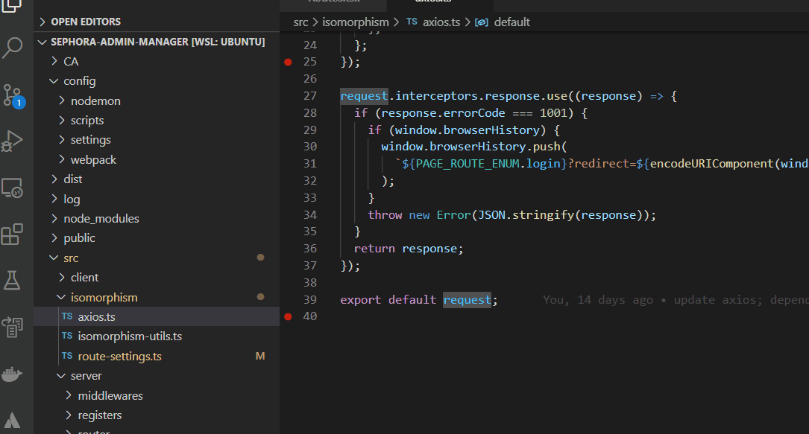

<!-- @import "[TOC]" {cmd="toc" depthFrom=1 depthTo=6 orderedList=false} -->

<!-- code_chunk_output -->

- [Typescript 使用总结及部分小技巧](#typescript-使用总结及部分小技巧)
  - [1. Typescript 部分常用可能会被忽略的知识点](#1-typescript-部分常用可能会被忽略的知识点)
    - [1.1 类型获取](#11-类型获取)
      - [1.1.1 typeof](#111-typeof)
      - [1.1.2 索引类型查询操作符 keyof](#112-索引类型查询操作符-keyof)
      - [1.1.3 索引访问](#113-索引访问)
    - [1.2 泛型的使用和定义](#12-泛型的使用和定义)
    - [1.3 条件类型的使用和定义](#13-条件类型的使用和定义)
  - [2. React 项目中的 Typescript](#2-react-项目中的-typescript)
    - [2.1 自定修复和自动导入](#21-自定修复和自动导入)
      - [2.1.1 书写时的智能提示和导入](#211-书写时的智能提示和导入)
      - [2.1.2 自动 fix 的自动导入](#212-自动-fix-的自动导入)
    - [2.2 定义组件的 props 中的类型](#22-定义组件的-props-中的类型)
      - [2.2.1 props 的 interface 定义位置](#221-props-的-interface-定义位置)
      - [2.2.2 导出可能会用到的类型（interface/type/enum）](#222-导出可能会用到的类型interfacetypeenum)
      - [2.2.3 使用和查找已定义的类型](#223-使用和查找已定义的类型)
    - [2.3 传递组件 props 时，使用到的类型](#23-传递组件-props-时使用到的类型)
    - [2.4 Vsocde 中的重构](#24-vsocde-中的重构)
      - [2.4.1 引用查找](#241-引用查找)
      - [2.4.2 引用重命名](#242-引用重命名)
    - [2.5 使用 code snippets](#25-使用-code-snippets)
      - [2.4.1 ES7 React/Redux/React-Native/JS snippets](#241-es7-reactreduxreact-nativejs-snippets)
      - [2.4.2 Typescript React Code snippets](#242-typescript-react-code-snippets)
  - [3 React Redux 结合 Typescript](#3-react-redux-结合-typescript)

<!-- /code_chunk_output -->

# Typescript 使用总结及部分小技巧

备份一篇去年写的关于ts 使用的小文章。

## 1. Typescript 部分常用可能会被忽略的知识点

### 1.1 类型获取

#### 1.1.1 typeof

使用 typeof 获取变量类型

```js
const Setting = {
  color: "red",
  font: "xxx",
  width: 100,
  height: 100,
  title: "xxxx",
};

type SettingType = typeof Setting;

function getPropX() {
  return "xxx";
}

type GetPropXType = typeof getPropX;
type GetPropXReturnType = ReturnType<typeof getPropX>;
```

#### 1.1.2 索引类型查询操作符 keyof

```ts
const Setting = {
  color: "red",
  font: "xxx",
  width: 100,
  height: 100,
  title: "xxxx",
};

// type SettingKey = 'color' | 'font' | 'width' | 'height' | 'title'
type SettingKey = keyof typeof Setting;
```

#### 1.1.3 索引访问

使用 `typeName['propName']` 格式读取属性类型

```ts
interface Person {
  name: string;
  age: string;
  sex: "man" | "woman";
  job?: string;
  eat: (food: string) => void;
}

type eat = Person["eat"];
```

### 1.2 泛型的使用和定义

> 泛型其实就是类型变量，根据传入的类型，获取到需要的类型

添加泛型的位置:

- 函数泛型 -- 在函数上添加泛型


- 类泛型 -- 在类上添加泛型

```ts
class GenericNumber<T> {
  zeroValue: T;
  add: (x: T, y: T) => T;
}
```

- 类型泛型 -- 在接口或类型别名(使用 type 或 interface 定义的类型)上添加泛型

```ts
// antd rowSelection 的类型
export interface TableRowSelection<T> {
  type?: RowSelectionType;
  selectedRowKeys?: Key[];
  onChange?: (selectedRowKeys: Key[], selectedRows: T[]) => void;
  getCheckboxProps?: (record: T) => Partial<Omit<CheckboxProps, "checked" | "defaultChecked">>;
  onSelect?: SelectionSelectFn<T>;
  onSelectMultiple?: (selected: boolean, selectedRows: T[], changeRows: T[]) => void;
  /** @deprecated This function is meaningless and should use `onChange` instead */
  onSelectAll?: (selected: boolean, selectedRows: T[], changeRows: T[]) => void;
  /** @deprecated This function is meaningless and should use `onChange` instead */
  onSelectInvert?: (selectedRowKeys: Key[]) => void;
  selections?: INTERNAL_SELECTION_ITEM[] | boolean;
  hideDefaultSelections?: boolean;
  fixed?: boolean;
  columnWidth?: string | number;
  columnTitle?: string | React.ReactNode;
  renderCell?: (
    value: boolean,
    record: T,
    index: number,
    originNode: React.ReactNode,
  ) => React.ReactNode | RcRenderedCell<T>;
}

// antd table columns 的类型
export declare type ColumnsType<RecordType = unknown> = (
  | ColumnGroupType<RecordType>
  | ColumnType<RecordType>
)[];
```

### 1.3 条件类型的使用和定义

常用的条件类型

> 更过预定义的条件类型 typescript/lib/lib.d.ts

- Partial<T> -- 使 T 中的所有属性变成可选属性
- Pick<T,K extends keyof T> -- 从 T 中挑选属性 K，组成新的类型
- Omit<T, K extends keyof any> -- 从 T 中删除属性 K，组成新的类型
- ReturnType<T extends (...args: any) => any> -- 获取函数的返回值类型
- Required<T> -- 使 T 中的所有属性变成必选属性
- Readonly<T> -- 使 T 中的所有属性变成只读属性
- Exclude<T, U> -- 从 T 中剔除可以赋值给 U 的类型。
- Extract<T, U> -- 提取 T 中可以赋值给 U 的类型。
- NonNullable<T> -- 从 T 中剔除 null 和 undefined。
- ReturnType<T> -- 获取函数返回值类型。
- InstanceType<T> -- 获取构造函数类型的实例类型。

## 2. React 项目中的 Typescript

此章节重点,类型定义和类型使用经验和小技巧

> 1.  使用 vscode 开发 typescript 时，强大的智能提示和自动导入以及自动修复功能的使用。

> 2.  类型的复用

### 2.1 自定修复和自动导入

#### 2.1.1 书写时的智能提示和导入

跨文件，可导入的 类型 / 方法 / 变量 ...的智能提示，以及自动导入


#### 2.1.2 自动 fix 的自动导入

单个修复导入 

所有修复导入 

### 2.2 定义组件的 props 中的类型

#### 2.2.1 props 的 interface 定义位置

> props 的 interface 定义位置: 组件文件中

```tsx
import * as React from "react";

interface IComNameProps {}

const ComName: React.FunctionComponent<IComNameProps> = (props) => {
  return <div>ComName</div>;
};

export default ComName;
```

#### 2.2.2 导出可能会用到的类型（interface/type/enum）

> 大部分组件的 props 的 interface, 可以使用 export 导出,方便在使用组件时，部分类型的使用(可以参考下一章节:[传递组件 props 时，使用到的类型](#传递组件-props-时使用到的类型))。

```ts
export interface IComNameProps {}
```

#### 2.2.3 使用和查找已定义的类型

> 定义组件 props 属性时，引用类属性，优先考虑使用已定义的类型（善用 vsocde 强大的引用提示，以及自动引入功能）

```tsx
import { Store } from "antd/lib/form/interface";
import { ResourceSaveDto } from "@/client/services/umgt/resource";

export interface PopupStore extends Store, ResourceSaveDto {}
```

### 2.3 传递组件 props 时，使用到的类型

> 上面定义并导出好组件和组件的类型后，在使用此组件时，可同时引入可能用到的类型

大部分组件的 props 传递时，需要的数据类型，都可以通过鼠标放上去的提示来找到。

> 1. 直接使用和引入单个 props 属性类型
> 2. 引入整个组件 props 类型，使用 interfaceName['propsName]


### 2.4 Vsocde 中的重构

#### 2.4.1 引用查找



#### 2.4.2 引用重命名

邮件重命名或者 F2 重命名


### 2.5 使用 code snippets

给大家推荐的 React Ts Extension Pack 包里，包含了两个下载量比较大的 react 语法段的包


#### 2.4.1 ES7 React/Redux/React-Native/JS snippets

```js
imp→	import moduleName from 'module'
imd→	import { destructuredModule } from 'module'
imr→	import React from 'react'

edf→	export default (params) => { }
cp→	const { } = this.props
cs→	const { } = this.state

------------------------------------------------------------------
rcc→
import React, { Component } from 'react'

export default class FileName extends Component {
  render() {
    return <div>$2</div>
  }
}

------------------------------------------------------------------
rcep→
import React, { Component } from 'react'
import PropTypes from 'prop-types'

export class FileName extends Component {
  static propTypes = {}

  render() {
    return <div>$2</div>
  }
}
-----------------------------------------------------------------
rafcp→
import React from 'react'
import PropTypes from 'prop-types'

const $1 = (props) => {
  return <div>$0</div>
}

$1.propTypes = {}

export default $1

export default $1

-----------------------------------------------------------------
rcredux→
import React, { Component } from 'react'
import { connect } from 'react-redux'

export class FileName extends Component {
  render() {
    return <div>$4</div>
  }
}

const mapStateToProps = (state) => ({})

const mapDispatchToProps = {}

export default connect(mapStateToProps, mapDispatchToProps)(FileName)

```

#### 2.4.2 Typescript React Code snippets

```tsx
// tsrsfc	stateless functional component
import * as React from "react";

interface IAppProps {}

const App: React.FunctionComponent<IAppProps> = (props) => {};

export default App;
-----------------------------------------------------------------
// tsrcc→	class component skeleton
import * as React from "react";

export interface IAppProps {}

export default class App extends React.Component<IAppProps> {
  public render() {
    return <div />;
  }
}
-----------------------------------------------------------------
// tscntr→	react redux container skeleton
import * as React from "react";
import { connect } from "react-redux";

export interface IAppProps {}

class App extends React.Component<IAppProps> {
  public render() {
    return <div />;
  }
}

const mapState2Props = (state) => {
  return {};
};

export default connect(mapState2Props)(App);


```

## 3 React Redux 结合 Typescript

[Redux Typescript 基础写法](https://redux.js.org/recipes/usage-with-typescript#type-checking-state)